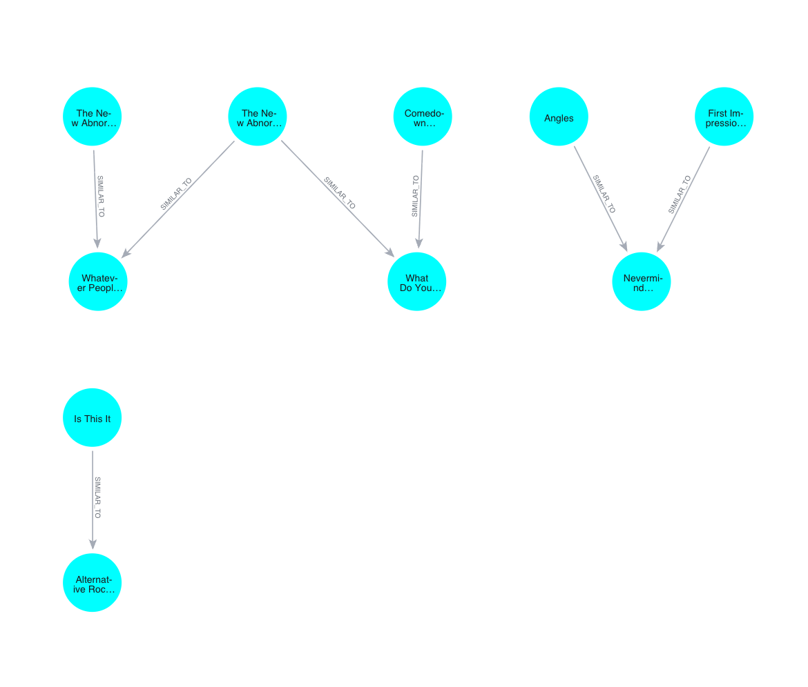

# Spotify Song Graph Recommender
### For DS4300: Large-Scale Information Storage and Retrieval SEC 01 S2026

A music recommendation engine built as a **graph database**. Each song is a node in Neo4j, similar songs are connected by edges, and recommendations come from walking the graph outward from songs you already like.



## Approach
1. **Sample the data** (`spoti.py`): all songs by two seed artists (The Strokes and Regina Spektor) plus a random sample of 1,000 other tracks from a Spotify tracks dataset (fixed `random_state=42`), giving **1,046 nodes**.
2. **Define similarity**: each song is a point in a space of nine standardized audio features (danceability, energy, loudness, speechiness, acousticness, instrumentalness, liveness, valence, tempo).
3. **Build edges**: k-nearest neighbors (k = 10, Euclidean distance) with scikit-learn, giving **10,460 `SIMILAR_TO` relationships** that store the distance.
4. **Export** `songs.csv` (node properties) and `edges.csv` (relationships) for Neo4j.
5. **Recommend** with Cypher (`neo4j-queries.pdf`): start at the seed artists' songs, follow `SIMILAR_TO` edges to songs by other artists, filter to related genres (rock, indie, alternative, punk, garage), and rank by average distance and number of supporting links.

Top results included Declan McKenna, Arctic Monkeys, Nirvana and Green Day (full list in `project-summary.pdf`).

## Graph model
- `(:Song {track_id, artists, album_name, track_name, popularity, duration_ms, explicit, ...audio features, track_genre})`
- `(:Song)-[:SIMILAR_TO {distance}]->(:Song)`

## Running
```
pip install pandas scikit-learn
python spoti.py     # needs spotify.csv (not included) in the same folder
```
Then copy `songs.csv` and `edges.csv` into Neo4j's import folder and run the load and recommendation queries from `neo4j-queries.pdf`.

The source dataset (`spotify.csv`, about 20 MB) is not included.
